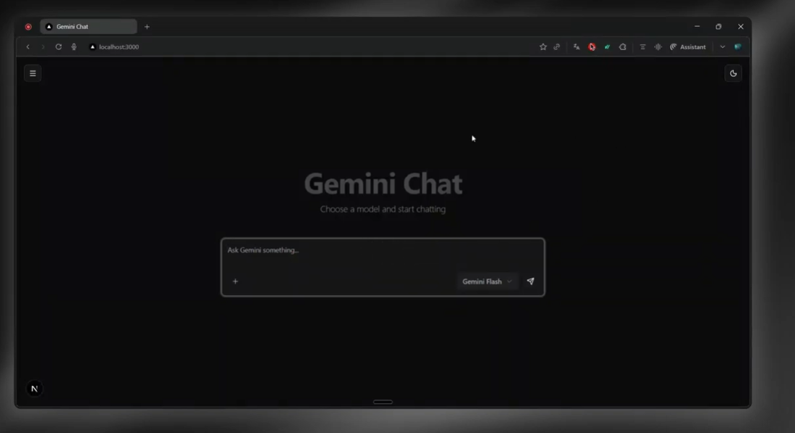

# Gemini Chat

A modern AI chatbot application leveraging the power of Google's Gemini AI models. Built with Next.js, TypeScript, TailwindCSS, and ConvexDB for a seamless real-time chat experience.



## Demo

**Watch the full demo:** [Gemini Chat Demo Video](https://www.youtube.com/watch?v=VElfo2NN5so)

## Features

### Core Functionality
- **Multi-Model Support**: Choose between Gemini Pro, Flash, and Lite models
- **Real-time Streaming**: Live streaming responses from AI models
- **Persistent Chat History**: Conversations saved and retrievable via ConvexDB
- **Search Conversations**: Find past conversations by title
- **Conversation Management**: Edit titles, delete conversations, start new chats
- **Responsive Design**: Works seamlessly on desktop and mobile devices

### User Experience
- **Dark/Light Theme**: Toggle between themes with system preference detection
- **Collapsible Sidebar**: Clean navigation with expandable chat history
- **Centered Chat Interface**: Modern chat panel that adapts based on conversation state
- **Real-time Updates**: Live message updates across browser sessions
- **Optimistic UI**: Smooth user experience with instant feedback

## Tech Stack

### Frontend
- **Next.js 15**: React framework with App Router
- **TypeScript**: Type-safe development
- **TailwindCSS**: Utility-first styling
- **ShadCN/UI**: Modern component library
- **AI SDK v5**: Streaming AI responses
- **Lucide Icons**: Beautiful icon set

### Backend & Database
- **ConvexDB**: Real-time database with automatic schema management
- **Convex Functions**: Serverless backend functions (queries, mutations, actions)
- **Persistent Text Streaming**: Real-time message streaming with database persistence

### AI Integration
- **Google Gemini API**: Advanced AI models (Pro, Flash, Lite)
- **Streaming Responses**: Real-time text generation
- **Model Switching**: Dynamic model selection during conversations

## Project Structure

```
gemini-chat/
├── app/
│   ├── (chat)/
│   │   ├── c/[conversationId]/
│   │   │   └── page.tsx           # Dynamic conversation pages
│   │   ├── layout.tsx             # Chat layout with sidebar
│   │   └── page.tsx               # Main chat interface
│   ├── api/
│   │   └── chat/
│   │       └── route.ts           # Streaming API endpoint
│   ├── layout.tsx                 # Root layout
│   ├── providers.tsx              # App providers
│   └── globals.css                # Global styles
│
├── components/
│   ├── chat/
│   │   ├── chat-panel.tsx         # Main input panel
│   │   ├── message-input.tsx      # Message input component
│   │   ├── model-selector.tsx     # Model selection dropdown
│   │   └── reset-button.tsx       # New chat button
│   ├── sidebar/
│   │   ├── sidebar.tsx            # Main sidebar container
│   │   ├── history-list.tsx       # Chat history list
│   │   ├── history-item.tsx       # Individual chat item
│   │   ├── search-bar.tsx         # History search
│   │   ├── new-chat-button.tsx    # New conversation button
│   │   └── sidebar-toggle.tsx     # Sidebar open/close toggle
│   ├── ai-elements/               # AI-specific UI components
│   ├── ui/                        # ShadCN UI components
│   ├── theme-provider.tsx         # Theme context provider
│   └── theme-toggle.tsx           # Dark/light theme toggle
│
├── convex/
│   ├── conversations.ts           # Conversation queries
│   ├── messages.ts                # Message queries
│   ├── mutations.ts               # Database mutations
│   ├── schema.ts                  # Database schema
│   ├── http.ts                    # HTTP endpoints
│   └── convex.config.ts           # Convex configuration
│
├── hooks/
│   ├── use-conversation.ts        # Conversation state management
│   └── use-sidebar.ts             # Sidebar state management
│
├── lib/
│   ├── convex.ts                  # Convex client setup
│   ├── types.ts                   # TypeScript definitions
│   └── utils.ts                   # Utility functions
│
└── public/
    ├── gemini-pro.svg             # Gemini Pro icon
    ├── gemini-flash.svg           # Gemini Flash icon
    └── gemini-lite.svg            # Gemini Lite icon
```

## Installation & Setup

### Prerequisites
- Node.js 18+ and npm/yarn
- Google AI Studio API key
- Convex account (free tier available)

### 1. Clone the Repository
```bash
git clone https://github.com/your-username/gemini-chat.git
cd gemini-chat
```

### 2. Install Dependencies
```bash
npm install
# or
yarn install
```

### 3. Environment Setup
Create a `.env.local` file in the root directory:

```env
# Convex Configuration
CONVEX_DEPLOYMENT=dev:your-deployment-name
NEXT_PUBLIC_CONVEX_URL=https://your-deployment.convex.cloud

# Google AI API Key
GOOGLE_GENERATIVE_AI_API_KEY=your_gemini_api_key_here
```

### 4. Initialize Convex
```bash
npx convex dev
```

This will:
- Create your Convex deployment
- Set up the database schema
- Start the development server

### 5. Run the Development Server
```bash
npm run dev
# or
yarn dev
```

Visit `http://localhost:3000` to see your application.

## Database Schema

### Conversations Table
```typescript
conversations: {
  _id: Id<"conversations">
  title: string
  model: "Pro" | "Flash" | "Lite"
  _creationTime: number
}
```

### Messages Table
```typescript
messages: {
  _id: Id<"messages">
  conversationId: Id<"conversations">
  role: "user" | "assistant"
  content: string
  _creationTime: number
}
```

## API Design

### Core Mutations
- `createConversation`: Start a new chat session
- `sendMessage`: Save user messages
- `saveAssistantMessage`: Store AI responses
- `updateConversationTitle`: Modify conversation titles
- `deleteConversation`: Remove conversations and messages

### Queries
- `conversations.get`: Fetch all conversations with optional search
- `messages.get`: Retrieve messages for a specific conversation

### Streaming Endpoint
- `POST /api/chat`: Stream responses from Gemini models

## Key Features Implementation

### Real-time Streaming
The application uses a hybrid approach combining HTTP streaming with database persistence:
- Live streaming for immediate user feedback
- Database storage for conversation persistence
- Real-time updates across browser sessions

### Model Selection
Users can switch between three Gemini models:
- **Gemini Pro**: Most capable model for complex tasks
- **Gemini Flash**: Balanced performance and speed
- **Gemini Lite**: Fastest responses for simple queries

### Conversation Management
- Automatic conversation creation on first message
- Searchable conversation history
- Editable conversation titles
- Complete conversation deletion

## Development Commands

```bash
# Start development server
npm run dev

# Build for production
npm run build

# Start production server
npm start

# Run TypeScript checks
npm run type-check

# Lint code
npm run lint

# Deploy Convex functions
npx convex deploy
```

## Deployment

### Vercel Deployment
1. Push code to GitHub repository
2. Deploy Convex backend: `npx convex deploy`
3. Connect repository to Vercel
4. Set environment variables in Vercel dashboard
5. Deploy automatically on push to main branch

### Environment Variables for Production
```env
NEXT_PUBLIC_CONVEX_URL=https://your-production-deployment.convex.cloud
CONVEX_DEPLOYMENT=your-production-deployment
GOOGLE_GENERATIVE_AI_API_KEY=your_api_key
```

## Architecture Highlights

### Frontend Architecture
- **App Router**: Modern Next.js routing with layouts
- **Component-driven**: Modular, reusable components
- **Type Safety**: Full TypeScript implementation
- **State Management**: Custom hooks for complex state logic

### Backend Architecture
- **Serverless Functions**: ConvexDB functions for all backend logic
- **Real-time Reactivity**: Automatic UI updates on data changes
- **Optimistic Updates**: Smooth UX with immediate feedback
- **Streaming Integration**: Persistent text streaming component

### Data Flow
1. User sends message through chat panel
2. Message saved to ConvexDB
3. Streaming request sent to Gemini API
4. Response streamed to client in real-time
5. Complete response saved to database
6. UI updated reactively across all sessions

## Performance Optimizations

- **Streaming Responses**: Immediate feedback without waiting for complete responses
- **Database Indexing**: Optimized queries for conversations and messages
- **Component Memoization**: Reduced unnecessary re-renders
- **Optimistic UI Updates**: Instant feedback for user actions
- **Lazy Loading**: Code splitting for optimal bundle size

## Security Considerations

- **API Key Protection**: Server-side API key handling
- **Input Validation**: ConvexDB schema validation
- **Type Safety**: TypeScript for runtime error prevention
- **Environment Variables**: Secure credential management

## Contributing

1. Fork the repository
2. Create a feature branch: `git checkout -b feature-name`
3. Commit changes: `git commit -m 'Add feature'`
4. Push to branch: `git push origin feature-name`
5. Submit a pull request

## License

This project is licensed under the MIT License - see the LICENSE file for details.

## Acknowledgments

- Google Gemini AI for powerful language models
- ConvexDB for real-time database capabilities
- Next.js team for the excellent framework
- ShadCN for beautiful UI components
- Vercel for seamless deployment platform

---

Built with care using modern web technologies for an exceptional AI chat experience.
